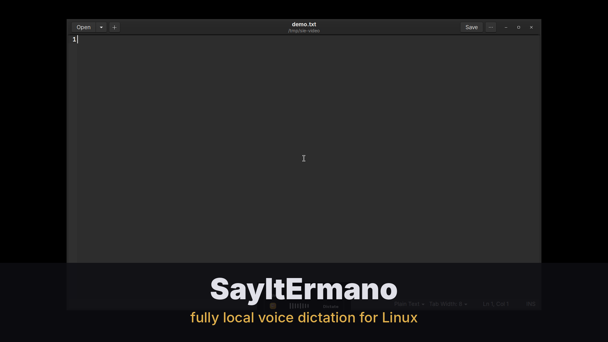

<p align="center">
  
</p>

<h1 align="center">SayItErmano</h1>

<p align="center">
  <strong>Dictation app for Linux</strong> — press a key, speak, and polished text lands in any app.<br>
  100% local speech-to-text · optional AI polish · native GTK 4 app
</p>

<p align="center">
  <a href="https://github.com/acailic/SayItErmano/releases"></a>
  <a href="LICENSE"></a>
  
  
</p>

<p align="center">
  
</p>

<p align="center">
  <a href="https://youtu.be/HWyjH-VCBAw" title="Watch the demo on YouTube">
    </a><br>
  <sub><a href="https://youtu.be/HWyjH-VCBAw">▶ Watch the one-minute demo video</a></sub>
</p>

> [!NOTE]
> This is an **unofficial, community port** of [FluidVoice](https://github.com/altic-dev/FluidVoice)
> — the free, open-source, on-device dictation app for macOS — to Linux. It is
> not built by the FluidVoice authors: the macOS app is Swift/Xcode, this is a
> Python implementation of the same behavior and, where licensed to do so
> (GPLv3), the same prompts, rules and sounds. See
> [docs/BEHAVIOR-SPEC.md](docs/BEHAVIOR-SPEC.md) for what was ported, with
> file:line evidence from the upstream sources.
>
> **Naming:** the project, package and commands are **SayItErmano**;
> only the Python module keeps the upstream `fluidvoice` name on
> purpose. Installing `sayit-ermano` replaces the pre-rename
> `fluidvoice-linux` package and takes over its config, history and
> models — details in the [install guide](docs/guides/install.md).

## What's new

**[v0.8.2](https://github.com/acailic/SayItErmano/releases/tag/v0.8.2)** — the
reliability + correctness release: **verified pasting** (paste mode proves
the target read the clipboard and the field got the text — duplicated
transcripts in terminals and lost dictations in browsers: fixed,
live-matrix evidenced), **focused-field context** (off by default), a
**hallucination guard** (fluent garbage over wrong-language or dead audio
never types), **chunked file transcription** (10-min overlapping chunks,
6 h ceiling), IPC hardening, a **first-use funnel**, the deb's **pinned
reproducible builds** and a native **AUR** recipe.

**[v0.8.1](https://github.com/acailic/SayItErmano/releases/tag/v0.8.1)** — the
macOS-parity release: upstream settings page order, prompt profiles as
**radio rows**, active-model radio indicator, History **Export as Text**
and **Pause saving**.

Older releases (v0.8.0 and back) live in the
[CHANGELOG](CHANGELOG.md).

## How it works

1. **Global hotkey** (default: Right Ctrl, toggle mode) starts recording — 16 kHz mono via PipeWire.
2. **Local transcription** — faster-whisper on CUDA GPU when available, CPU int8 otherwise (whisper.cpp, torch, and NVIDIA Parakeet TDT via ONNX Runtime backends also supported).
3. **Post-processing chain** — filler-word removal → custom dictionary → **spoken punctuation commands** (`literal comma`, `literal new line`, `example literal dot com`, …) — the full FluidVoice rule table.
4. **Optional AI polish** — the *verbatim* FluidVoice dictation prompt sent to any OpenAI-compatible endpoint (OpenAI, Groq, Ollama, LM Studio, llama.cpp server). Turns *"um lets meet on tuesday around 3 no wait 4 p.m."* into *"Let's meet on Tuesday at 4 p.m."*
5. **Text insertion** — `xdotool type` keystrokes (clipboard-free), or verified clipboard paste with automatic restore for long texts. Plus history, start/stop sounds (the original GPLv3 FluidVoice SFX), and desktop notifications.

```
hotkey ─▶ pw-record 16k mono ─▶ faster-whisper (CUDA/int8) ─▶ fillers/dictionary/
                                                                spoken-punctuation
                                                                        │
        typed into focused app ◀─ xdotool type / paste+restore ◀─ optional AI polish
                                                  (OpenAI-compatible / Ollama)
```

## Installation

**Quick start** — one download + one command, then SayItErmano appears in
your app launcher, autostarts at login, and needs no terminal. The default
install is user-space and needs no sudo at all; it only asks for sudo if a
required system package (GTK/pygobject, xdotool, …) is missing:

```bash
curl -fsSL https://raw.githubusercontent.com/acailic/SayItErmano/linux/scripts/install-one-shot.sh | bash
```

Press **Right Ctrl**, speak, press **Right Ctrl** again. Done.

All routes — the one-shot installer (user or `--system`), the official
Ubuntu 24.04 .deb, pipx/pip on any distro, the AUR package, building
from source, and how updates work — are documented in
[docs/guides/install.md](docs/guides/install.md). Requirements in brief:
Python 3.11+, `pipewire`/`xdotool`/`xclip`/`libnotify-bin`, a whisper
model on first use (default `small` ≈ 484 MB), GPU optional. On Wayland
you need `wtype`/`ydotool` and a DE shortcut:
[docs/guides/wayland.md](docs/guides/wayland.md).

## The native app

<p>

</p>

<p>


</p>

`sayit-ermano app` opens a native GTK 4 / libadwaita app (single instance;
follows your system theme) that mirrors the macOS app's windows — the
settings sidebar even keeps the Mac's **Settings / More** section grouping
and page order:

- **History** (main window) — live status header, search, copy/delete,
  inline audio replay, **Export as ZIP or plain text**, **Pause saving**.
- **Settings** — **General** / **Dictation** (hotkeys, languages, mic,
  commands) / **Models** (radio-marked active, one-click switch +
  download) / **AI polish** (any OpenAI-compatible endpoint, prompt
  profiles, per-app prompts) / **History** / **Wayland** / **About**.
  Saving hot-applies what the daemon can take live and says what needs
  a restart.
- **Onboarding** — opens once on first launch with a real 3-second tryout.

With the daemon stopped, History still works and Settings writes the
config directly. Settings talk to the daemon over the user-owned unix
control socket — no network listener exists; API keys are never exposed
through the UI (use the env var).

### Enable AI polish (optional)

```toml
[ai]
enabled  = true
base_url = "http://localhost:11434/v1"   # Ollama; or OpenAI/Groq/LM Studio
model    = "qwen3:8b"                    # pick a general-purpose chat model
```

With Ollama: `ollama pull qwen3:8b`. No key needed for local endpoints; for cloud
providers set `api_key_env = "SAYITERMANO_API_KEY"` and export the variable
(keys are never written to disk by the tooling).

A **refusal guardrail** (`ai.refusal_guard`, default on) never types model
refusals into your document — the raw transcript is used instead; see
[configuration.md](docs/guides/configuration.md).

## Features vs. upstream FluidVoice

| Feature | macOS (upstream) | Linux port (SayItErmano) |
|---|---|---|
| Push hotkey → dictate → text in any app | ✅ (Right ⌥) | ✅ (Right Ctrl / any key) |
| 100% local transcription | ✅ (Parakeet/Nemotron/Whisper/Apple) | ✅ (faster-whisper/whisper.cpp/Parakeet TDT via ONNX; `backend = "parakeet"`) |
| Toggle & hold (push-to-talk) modes | ✅ | ✅ toggle; hold for non-modifier keys (other keys pass through while held) |
| Mouse-button push-to-talk | ✅ (PR #939) | ✅ spare button 6–255 (`recording.push_to_talk_button = "button8"`; clicks pass through while held; buttons 1–5 refused) |
| Hotkeys pause while the screen is locked | ✅ | ✅ `general.pause_when_locked` (logind watch, resolves the session under the systemd user unit too; active dictation cancels, tray notes `paused (locked)`) |
| Filler-word removal + custom dictionary | ✅ | ✅ (same defaults) |
| Spoken punctuation ("literal comma") | ✅ full rule table | ✅ ported (dot/slash/at-sign contexts included) |
| AI polish with the original prompt | ✅ (local Fluid Intelligence or cloud) | ✅ (any OpenAI-compatible endpoint; no bundled local LLM yet) |
| Start/stop sounds | ✅ | ✅ (same GPLv3 SFX) |
| Live streaming preview overlay | ✅ | ✅ Mac-style pill (live waveform, mode accent colors, state labels, send indicator) |
| Write/Rewrite selected text | ✅ (⌥R) | ✅ dedicated rewrite hotkey |
| Command mode (voice → terminal agent) | ✅ (notch chat panel) | ✅ dedicated hotkey, live conversation panel, upstream tool schema in the JSON protocol, destructive strong-confirm, per-app context, History Commands view |
| Per-app prompt sets | ✅ | ✅ Settings → AI → Per-app prompts (per-app instructions captured with the app hint) |
| Settings UI with model picker | ✅ | ✅ native GTK app (`sayit-ermano app`): Settings + History windows |
| Onboarding (setup + tryout) | ✅ | ✅ opens once on first launch (`sayit-ermano app --onboard`) |
| Overlay sizes (pill/small/medium/large) | ✅ | ✅ `recording.preview_overlay_size` |
| Notch overlay / menu bar | ✅ | ✅ tray/panel icon (StatusNotifierItem): click = dictate, state badge, tooltip with hotkey |

See [docs/STATUS.md](docs/STATUS.md) for the full done/left ledger,
[docs/COMPARISON.md](docs/COMPARISON.md) for other Linux dictation tools,
[docs/ROADMAP.md](docs/ROADMAP.md) for the forward plan, and
[docs/UPSTREAM-TRACKING.md](docs/UPSTREAM-TRACKING.md) for the
macOS-vs-Linux capability matrix — everything under `docs/` is indexed in
[docs/README.md](docs/README.md).

## Configuration

Everything lives in `~/.config/sayit-ermano/config.toml` (`sayit-ermano
config init` writes the full commented template). The complete annotated
reference is [docs/guides/configuration.md](docs/guides/configuration.md);
special-purpose pages: [command mode](docs/guides/command-mode.md),
[remote STT server](docs/guides/remote-stt.md),
[file transcription](docs/guides/file-transcription.md), and
[scripting the daemon / MCP](docs/guides/scripting-and-mcp.md).

## Development & testing

Read [AGENTS.md](AGENTS.md) first — one tree per agent, how tests are
run, merge-back policy. The tier model (offline unit, display/GTK,
process, integration) and every recipe live in
[docs/dev/testing.md](docs/dev/testing.md); `just gate` is the bar every
commit clears.

## License & credits

- **GPL-3.0** — same license as upstream. The dictation/edit prompts and the
  start/stop sounds are copied from [altic-dev/FluidVoice](https://github.com/altic-dev/FluidVoice)
  (GPLv3). Huge thanks to the FluidVoice authors for open-sourcing it.
- Speech by [faster-whisper](https://github.com/SYstran/faster-whisper) (MIT) /
  [whisper.cpp](https://github.com/ggml-org/whisper.cpp) (MIT) /
  [OpenAI Whisper](https://github.com/openai/whisper) (MIT).
- "FluidVoice" is the upstream project's name; SayItErmano is this
  community-maintained Linux port of it and is not affiliated with or
  endorsed by altic-dev.
