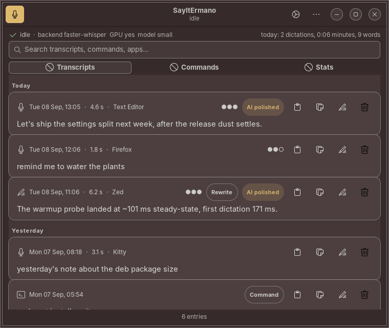
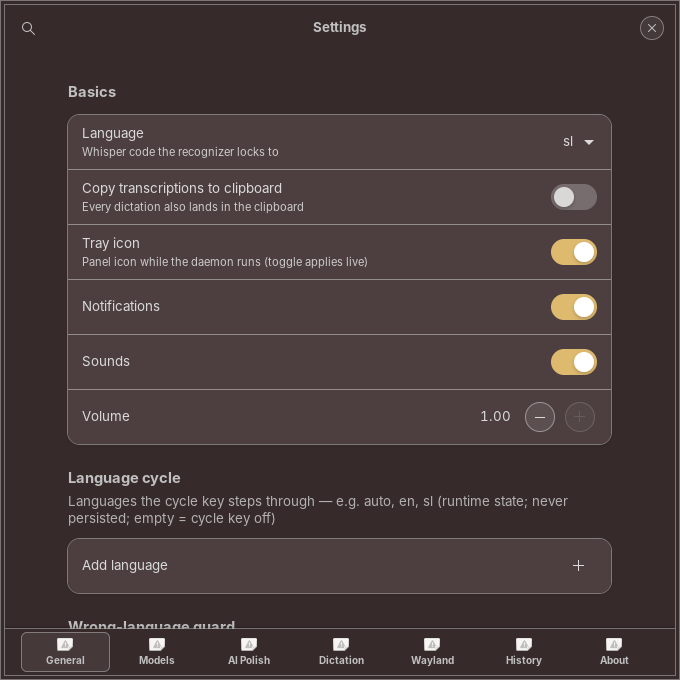
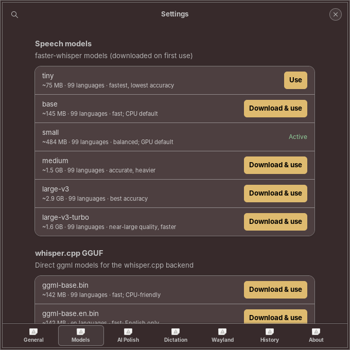
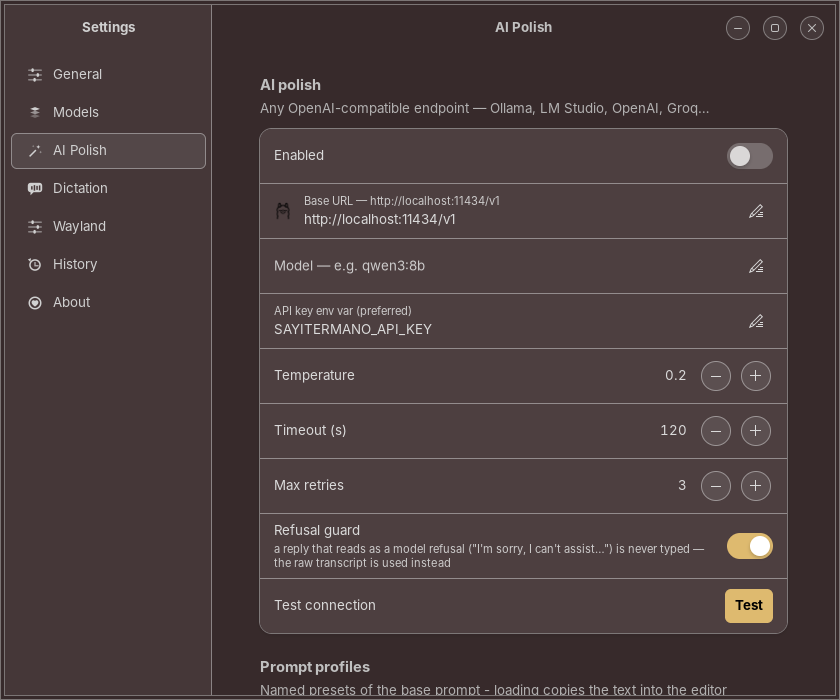
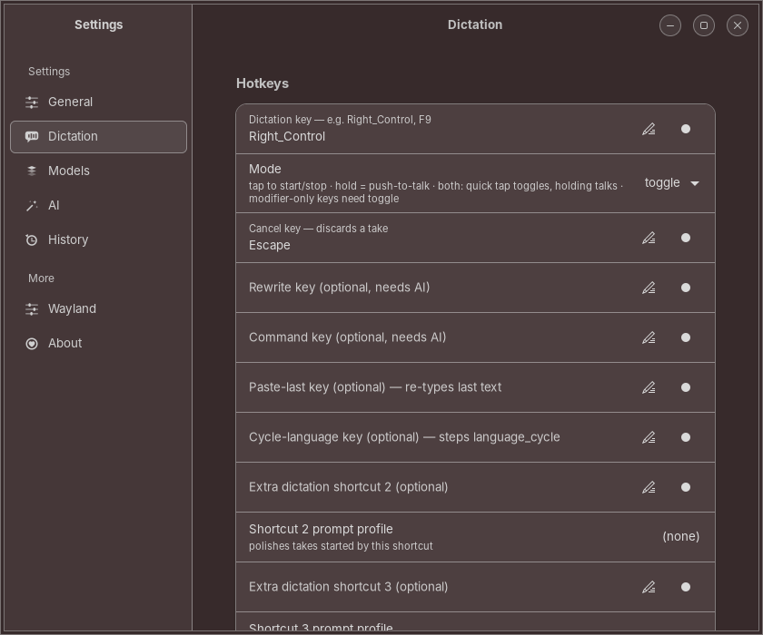
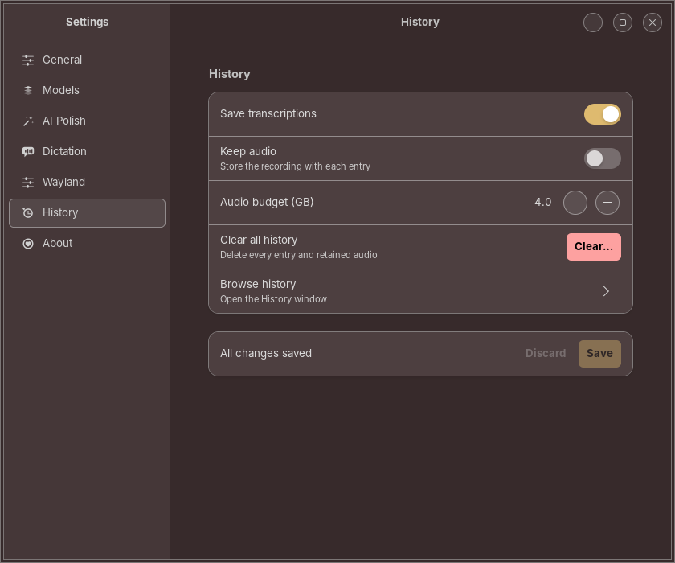
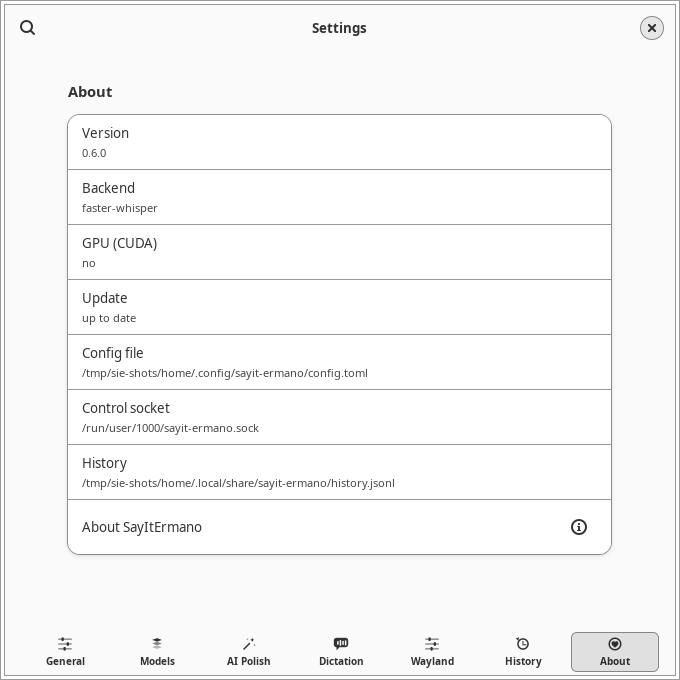

<p align="center">
  
</p>

<h1 align="center">SayItErmano</h1>

<p align="center">
  <strong>Dictation app for Linux</strong> — press a key, speak, and polished text lands in any app.<br>
  100% local speech-to-text · optional AI polish · native GTK 4 app
</p>

<p align="center">
  <a href="https://github.com/acailic/SayItErmano/releases"></a>
  <a href="LICENSE"></a>
  
  
  
</p>

<p align="center">
  
</p>

> [!NOTE]
> This is an **unofficial, community port** of [FluidVoice](https://github.com/altic-dev/FluidVoice)
> — the free, open-source, on-device dictation app for macOS — to Linux. It is
> not built by the FluidVoice authors: the macOS app is Swift/Xcode, this is a
> Python implementation of the same behavior and, where licensed to do so
> (GPLv3), the same prompts, rules and sounds. See
> [docs/BEHAVIOR-SPEC.md](docs/BEHAVIOR-SPEC.md) for what was ported, with
> file:line evidence from the upstream sources.
>
> **Naming:** the project, repo, package, command and env-var overrides
> (`SAYITERMANO_CONFIG`, `SAYITERMANO_SOCKET`, `SAYITERMANO_API_KEY`, …) are
> **SayItErmano** (`sayit-ermano`). Only the Python module keeps the upstream
> `fluidvoice` naming on purpose — internals credit the port's origin.
> Installing `sayit-ermano` replaces the pre-rename `fluidvoice-linux` package
> and takes over its config, history and models.

## What's new

**[v0.4.0](https://github.com/acailic/SayItErmano/releases/tag/v0.4.0)** — the
SayItErmano identity: repo, .deb package, command, launcher and tray entry all
carry the new name, plus an **original app icon** (gold tile, speech bubble +
waveform — no FluidVoice artwork anywhere). One-shot installer now defaults to
a user-space install with no sudo.

## How it works

1. **Global hotkey** (default: Right Ctrl, toggle mode) starts recording — 16 kHz mono via PipeWire.
2. **Local transcription** — faster-whisper on CUDA GPU when available, CPU int8 otherwise (whisper.cpp, torch, and NVIDIA Parakeet TDT via ONNX Runtime backends also supported).
3. **Post-processing chain** — filler-word removal → custom dictionary → **spoken punctuation commands** (`literal comma`, `literal new line`, `example literal dot com`, …) — the full FluidVoice rule table.
4. **Optional AI polish** — the *verbatim* FluidVoice dictation prompt sent to any OpenAI-compatible endpoint (OpenAI, Groq, Ollama, LM Studio, llama.cpp server). Turns *"um lets meet on tuesday around 3 no wait 4 p.m."* into *"Let's meet on Tuesday at 4 p.m."*
5. **Text insertion** — `xdotool type` keystrokes (clipboard-free), or clipboard paste with automatic restore for long texts. Paste is verified by observing the target read the selection before your clipboard is restored, dictation text flashes are hidden from clipboard managers (CopyQ live-verified), and terminal apps get `ctrl+shift+v`. Plus history, start/stop sounds (the original GPLv3 FluidVoice SFX), and desktop notifications.

```
hotkey ─▶ pw-record 16k mono ─▶ faster-whisper (CUDA/int8) ─▶ fillers/dictionary/
                                                                spoken-punctuation
                                                                        │
        typed into focused app ◀─ xdotool type / paste+restore ◀─ optional AI polish
                                                  (OpenAI-compatible / Ollama)
```

## Installation

### Quick start — one-shot installer

One download + one command, then SayItErmano appears in your app launcher,
autostarts at login, and needs no terminal. The default install is
**user-space and needs no sudo at all** (`~/.local/…` + a systemd user unit
that shadows any system unit); it only asks for sudo if a required system
package (GTK/pygobject, xdotool, …) is missing:

```bash
curl -fsSL https://raw.githubusercontent.com/acailic/SayItErmano/linux/scripts/install-one-shot.sh | bash
```

Prefer the classic system-wide .deb (root-owned, `/opt` runtime)?

```bash
curl -fsSL https://raw.githubusercontent.com/acailic/SayItErmano/linux/scripts/install-one-shot.sh | bash -s -- --system
```

### Manual download

```bash
curl -LO https://github.com/acailic/SayItErmano/releases/download/v0.4.0/sayit-ermano_0.4.0-2_amd64.deb
sudo apt install ./sayit-ermano_0.4.0-2_amd64.deb
```

Grab a specific version from the [releases page](https://github.com/acailic/SayItErmano/releases),
or build it yourself: `git clone … -b linux && ./packaging/build-deb.sh`.

**What you get after install** (log out/in once):

- **App launcher entry "SayItErmano"** (opens the native app) with its own icon
- **Daemon autostarts at login** (XDG autostart; a systemd user unit is also
  provided: `systemctl --user enable --now sayit-ermano`)
- `sayit-ermano` available everywhere in PATH (`doctor`, `toggle`,
  `settings`, `history`, …)
- Removes cleanly with `sudo apt remove sayit-ermano` — upgrading from the
  pre-rename `fluidvoice-linux` package replaces it automatically; your
  config, history and downloaded models are kept

### From source (development)

```bash
git clone https://github.com/acailic/SayItErmano.git -b linux
cd SayItErmano
./scripts/install.sh          # apt deps + venv (reuses your CUDA torch if present)

# run it (foreground; systemd unit in systemd/)
.venv/bin/sayit-ermano daemon
```

Press **Right Ctrl**, speak, press **Right Ctrl** again. Done.

Useful commands:

```bash
sayit-ermano app               # native GTK app: History, Settings, onboarding
sayit-ermano doctor            # environment check
sayit-ermano toggle            # CLI trigger (bind to a DE shortcut on Wayland)
sayit-ermano cancel            # abort a recording
sayit-ermano transcribe x.opus --json   # one-shot file transcription
sayit-ermano history -n 10
sayit-ermano config init       # write ~/.config/sayit-ermano/config.toml
sayit-ermano update            # check for a newer release + print the upgrade command
```

### pipx / pip (any distro)

Works on any Linux with Python 3.11+ — a pipx install lands under
`~/.local/pipx` (or `~/.local/share/pipx`) and never touches the system
Python:

```bash
pipx install sayit-ermano          # from PyPI (publishing is manual — if the
                                   # latest release isn't on PyPI yet, use:)
pipx install git+https://github.com/acailic/SayItErmano.git@linux
```

Upgrades are one command (`sayit-ermano update` detects the pipx install
and prints exactly this):

```bash
pipx upgrade sayit-ermano
```

You can also install a locally built wheel (e.g. after `git clone` +
`uv build --wheel`): `pipx install ./dist/sayit_ermano-<ver>-py3-none-any.whl`.
Verify an install any time with `./scripts/verify-pipx.sh` (entry points,
data files, and the updater's install-method detection, in a sandbox).

Using the one-shot user install instead? Its bundled venv can be upgraded
directly (the exact line `sayit-ermano update` prints for that layout):

```bash
~/.local/share/sayit-ermano/venv/bin/pip install -U sayit-ermano
```

(re-running the one-shot installer is the fully supported path — it also
restarts the daemon and cleans up duplicate installs.)

### Arch Linux (AUR)

An AUR recipe is maintained in [`packaging/aur/`](packaging/aur/)
(`sayit-ermano-bin`, built from the release `.deb` asset) — community-
adopted, **not published by us** (project rule: manual releases only).

### Requirements

- **X11**: the full experience (global hotkey grab + xdotool typing + the
  pill preview). **Wayland is supported** since v0.3 — see the matrix
  below; you need `wtype` or `ydotool` for text insertion and a
  desktop-environment custom shortcut for the hotkey (Settings → Wayland
  assists with both).
- Python 3.11+ (tested 3.12), `pipewire` (`pw-record`), `xdotool`, `xclip`,
  `libnotify-bin`, `pulseaudio-utils` (sounds).
- A whisper model is downloaded on first use (~75 MB tiny … ~3.1 GB large-v3;
  default `small` ≈ 484 MB, or `base` on CPU). For the whisper.cpp backend,
  the curated GGUF models are one-click downloads in Settings → Models.
- GPU is optional: faster-whisper uses CUDA automatically when cuBLAS 12 +
  cuDNN 9 are resolvable; otherwise it falls back to CPU int8.

### Wayland support

| Capability | X11 | Wayland |
|---|---|---|
| Global hotkey | `XGrabKey` (toggle + hold) | DE custom shortcut → the generated `sayit-ermano-toggle` script (Settings → Wayland prints the per-GNOME/KDE/COSMIC steps; `sayit-ermano doctor` too). Optional **evdev push-to-talk**: hold a physical key read from `/dev/input` (`hotkey.wayland_evdev`, privileged — `input` group + `pip install 'sayit-ermano[wayland]'`) |
| Text insertion | `xdotool type` | `wtype` (wlroots/KDE — GNOME has no virtual-keyboard protocol) or `ydotool` (any compositor; needs `ydotoold` running + `/dev/uinput` access). `insertion.wayland_tool` = `auto\|wtype\|ydotool` |
| Paste mode | verified read-observation + clipboard restore | `wl-clipboard` + fixed settle + restore — **paste verification is impossible on Wayland** (no client can observe another client's selection reads), and no clipboard-manager hygiene markers can be advertised |
| Live preview | X11 pill | notification bubble (the layer-shell pill on wlroots compositors is future work; no pill on GNOME-Wayland) |
| Tray | StatusNotifierItem | StatusNotifierItem (same) |
| App hints / terminal quirks | WM_CLASS via `xdotool` | unavailable (AT-SPI is future work) — `general.terminal_apps` quirks are inert |

Install the tools:

```bash
sudo apt install wtype wl-clipboard        # sway/wlroots, KDE
sudo apt install ydotool wl-clipboard       # any compositor incl. GNOME:
sudo systemctl enable --now ydotool         # ydotoold must run; /dev/uinput
sudo usermod -aG input $USER                # only for evdev push-to-talk
```

`sayit-ermano doctor` prints the per-capability matrix with per-tool
found/missing on your session, and `sayit-ermano status` carries the same
matrix (additive `session`/`capabilities` keys in the JSON).

## The native app

<p>

</p>

<p>



</p>
<p>



</p>

`sayit-ermano app` opens a native GTK 4 / libadwaita app (single instance;
follows your system theme) that mirrors the macOS app's windows:

- **History** (main window) — live status header, search, copy/delete,
  inline audio replay for retained recordings.
- **Settings** — General / Models (one-click switch + download) / AI polish
  (any OpenAI-compatible endpoint, live Test connection, per-app prompts) /
  Dictation (hotkeys with press-to-capture, mic picker, live-preview sizes,
  spoken send) / History. Saving hot-applies what the daemon can take live
  (hotkey re-grab, recorder/tray/model rebuild) and says what needs a restart.
- **Onboarding** — opens once on first launch with a real 3-second tryout.

With the daemon stopped, History still works and Settings saves to the
config file directly (applies on next daemon start). Everything it saves goes
to the same `config.toml` (with a strict whitelist; API keys are never exposed
through the UI — use the env var). Settings talk to the daemon over the
user-owned unix control socket — no network listener exists. The config file
is written with 0600 permissions.

### Enable AI polish (optional)

```toml
[ai]
enabled  = true
base_url = "http://localhost:11434/v1"   # Ollama; or OpenAI/Groq/LM Studio
model    = "qwen3:8b"                    # pick a general-purpose chat model
```

With Ollama: `ollama pull qwen3:8b`. No key needed for local endpoints; for cloud
providers set `api_key_env = "SAYITERMANO_API_KEY"` and export the variable
(keys are never written to disk by the tooling).

### Command mode (voice → terminal agent)

Set `command_key` under `[hotkey]` to a spare keysym (e.g. `F10`); like the
rewrite key it needs `[ai]` enabled with a base URL and model. Press it and
dictate an instruction ("list the biggest files in my downloads folder");
stop the recording with the main dictation key. The model answers in a
strict-JSON tool-call protocol (the upstream `execute_terminal_command`
schema) and proposes shell commands — shown in the pill overlay in an
awaiting-confirmation state — and you press the command hotkey again to run
each one; `Escape` cancels. **Every** command requires that explicit
confirmation before anything executes; output is fed back to the model and
the loop continues (bounded by `[command] max_turns`).

Commands matching the built-in **destructive list** (ported from upstream:
`rm`, `mv`, `sudo`, `kill`, `chmod`, `dd`, redirections, `xargs rm`, …) or
your own patterns get a stronger gate: an amber ⚠ pill and a **two-press**
confirm — the first press only arms, the second runs.

Follow-up context: within `command.context_window_s` (default 300 s, `0`
disables) the last five executed results in the *same* focused app are
replayed to the model so "now the biggest one" works; say **"new session"**
to clear it. Nothing is persisted — a daemon restart starts cold.

Executed commands land in History, which has a **Commands** page showing
command, purpose, exit code, duration and collapsible output, with Copy and
**Re-run** (re-run only re-posts a proposal — it still needs the hotkey
confirm, never silent):

```toml
[command]
context_window_s = 300.0
# extra strings treated as destructive (case-insensitive substrings):
destructive_patterns = ["git push", "shutdown"]
```

<details>
<summary><strong>File transcription</strong> (<code>sayit-ermano transcribe</code>)</summary>

Accepts **wav, flac, mp3, opus, oga, ogg, m4a, aac, wma, aiff, webm** (verified
to decode via PyAV). Unknown extensions are still attempted: anything PyAV
can't open is converted with **ffmpeg** to 16 kHz mono WAV first
(`sudo apt install ffmpeg` if it's missing). The whisper.cpp backend always
converts via ffmpeg since `whisper-cli` reliably reads WAV only.

- `--json` prints `{text, language, duration_s, segments}` where `segments`
  are raw `{start, end, text}` per-segment entries with timestamps
  (not post-processed; `[]` on the whisper.cpp backend — segment parsing
  isn't wired up there in v1).
- `--out PATH` writes the result to a file instead of stdout (JSON with
  `--json`); missing parent directories are created.
- Inputs over 25 MB warn: transcription is **not chunked** in v1 and may be
  slow/memory-heavy — shrink first with
  `ffmpeg -i in.opus -ar 16000 -ac 1 out.wav`.

</details>

## Features vs. upstream FluidVoice

| Feature | macOS (upstream) | Linux port (SayItErmano) |
|---|---|---|
| Push hotkey → dictate → text in any app | ✅ (Right ⌥) | ✅ (Right Ctrl / any key) |
| 100% local transcription | ✅ (Parakeet/Nemotron/Whisper/Apple) | ✅ (faster-whisper/whisper.cpp/Parakeet TDT via ONNX; `backend = "parakeet"`) |
| Toggle & hold (push-to-talk) modes | ✅ | ✅ toggle; hold for non-modifier keys (other keys pass through while held) |
| Mouse-button push-to-talk | ✅ (PR #939) | ✅ spare button 6–255 (`recording.push_to_talk_button = "button8"`; clicks pass through while held; buttons 1–5 refused) |
| Hotkeys pause while the screen is locked | ✅ | ✅ `general.pause_when_locked` (logind watch, resolves the session under the systemd user unit too; active dictation cancels, tray notes `paused (locked)`) |
| Filler-word removal + custom dictionary | ✅ | ✅ (same defaults) |
| Spoken punctuation ("literal comma") | ✅ full rule table | ✅ ported (dot/slash/at-sign contexts included) |
| AI polish with the original prompt | ✅ (local Fluid Intelligence or cloud) | ✅ (any OpenAI-compatible endpoint; no bundled local LLM yet) |
| Start/stop sounds | ✅ | ✅ (same GPLv3 SFX) |
| Live streaming preview overlay | ✅ | ✅ Mac-style pill (live waveform, mode accent colors, state labels, send indicator) |
| Write/Rewrite selected text | ✅ (⌥R) | ✅ dedicated rewrite hotkey |
| Command mode (voice → terminal agent) | ✅ (notch chat panel) | ✅ dedicated hotkey, live conversation panel, upstream tool schema in the JSON protocol, destructive strong-confirm, per-app context, History Commands view |
| Per-app prompt sets | ✅ | 🚧 roadmap (app hint is already captured) |
| Settings UI with model picker | ✅ | ✅ native GTK app (`sayit-ermano app`): Settings + History windows |
| Onboarding (setup + tryout) | ✅ | ✅ opens once on first launch (`sayit-ermano app --onboard`) |
| Overlay sizes (pill/small/medium/large) | ✅ | ✅ `recording.preview_overlay_size` |
| Notch overlay / menu bar | ✅ | ✅ tray/panel icon (StatusNotifierItem): click = dictate, state badge, tooltip with hotkey |

See [docs/STATUS.md](docs/STATUS.md) for the full done/left ledger (verified
by a 5-agent audit against the upstream Swift sources),
[docs/COMPARISON.md](docs/COMPARISON.md) for how this relates to other Linux
dictation tools (Handy, Vocalinux, nerd-dictation, …),
[docs/ROADMAP.md](docs/ROADMAP.md) for the forward plan, and
[docs/UPSTREAM-TRACKING.md](docs/UPSTREAM-TRACKING.md) for the
macOS-vs-Linux capability matrix and the upstream changelog we track
(refresh it with `scripts/upstream-diff.sh`).

## Updates

SayItErmano checks GitHub **once per daemon start and once a day** for a
newer release (10 s timeout, on a background thread — startup is never
delayed). When a newer release is seen you get **one desktop
notification**; `sayit-ermano status`, the History window's status row,
Settings → About and `sayit-ermano doctor` show it too. Nothing is ever
installed automatically — run:

```bash
sayit-ermano update    # prints the exact copy-paste upgrade command for
                       # YOUR install method (deb dpkg -i / one-shot
                       # installer / pipx upgrade / git pull)
sayit-ermano update --dismiss   # stop the notification for this release
```

`doctor` also warns when a system deb (`/opt/sayit-ermano`) and a user
install (`~/.local/share/sayit-ermano`) coexist — the two-daemon hotkey
fight this project's lock file guards against at runtime.

Disable the checks entirely:

```toml
[updates]
check = false   # no GitHub probe at all (notify = false keeps checks, drops
                # only the desktop notification)
```

(`SAYITERMANO_SKIP_UPDATE_CHECK=1` does the same per-run.)

## Configuration

Everything lives in `~/.config/sayit-ermano/config.toml` (generated by
`sayit-ermano config init`; full commented template). Highlights:

```toml
[hotkey]
key = "Right_Control"       # any keysym: F9, space, Pause, right_alt...
mode = "toggle"             # or "hold" (push-to-talk; other keys pass through while held)

[model]
name = "small"              # tiny/base/small/medium/large-v3/large-v3-turbo
# backend = "whisper.cpp"    # use the external whisper-cli binary instead
whispercpp_model = "ggml-base.bin"  # catalog name or path — download via Settings → Models
# backend = "parakeet"       # NVIDIA Parakeet TDT via ONNX Runtime (pip install '.[parakeet]')
# name = "parakeet-tdt-0.6b-v2"     # or parakeet-tdt-0.6b-v3 (multilingual)
device = "auto"             # auto | cuda | cpu
# idle_unload_s = 0          # unload the model after N idle seconds (0 = never; 30..86400)

[general]
# Case-insensitive WM_CLASS substrings identifying terminals — spoken-send
# never presses Enter here and typed insertions gain one autocomplete space
terminal_apps = ["gnome-terminal", "kgx", "konsole", "xterm", "alacritty", "kitty", "wezterm", "ghostty", "foot", "tilix", "terminator", "guake", "yakuake", "st-256color", "warp"]

[recording]
mic_priority = ["bluez", "usb-cam"]  # fallback order when the chosen mic vanishes
# (Bluetooth headset first, then a USB webcam; switch never happens mid-take)
# Mouse push-to-talk: hold a spare button to dictate (always hold-style,
# independent of hotkey.mode). Thumb buttons are usually 8/9; 1–5 refused.
push_to_talk_button = "button8"  # "" = off

[general]
# Ignore hotkeys + cancel active dictation while the session is locked
pause_when_locked = true

[processing]
dictionary = [ { triggers = ["miro board"], replacement = "Miro board" } ]
# Corrections you make in History teach the dictionary: after the same
# fix is seen twice, Settings -> Dictation suggests it under "Suggested words"
# Chat-app literal squeeze: "/ fix the deploy" -> "/fix the deploy",
# "@ John Smith" -> "@John Smith" (runs after AI cleanup)
slash_mention_squeeze = true

[insertion]
mode = "auto"               # typed | paste | auto (paste for long texts)
# One trailing space after typed insertions in terminal apps so the shell's
# autocomplete commits
terminal_autocomplete_space = true
# Verify the paste landed (selection read) before restoring the clipboard;
# false = legacy fixed-delay restore
verify_paste = true
# Keystroke used to paste in terminal apps (general.terminal_apps); X11
# terminals pass ctrl+v through to the app, they need ctrl+shift+v
terminal_paste_key = "ctrl+shift+v"
```

**Why is my first dictation slow after a break?** With `idle_unload_s`
set (Settings → Models → Memory), the speech model is released after the
idle window to free RAM — and VRAM on GPU machines — instead of staying
pinned in memory forever. The first dictation afterwards pays the model
load again (a few seconds; the load overlaps your speech), while the
following ones are instant. Set it to `0` — the default — to keep the
model always loaded, and check the live state any time with
`sayit-ermano doctor` (it prints `model: loaded/unloaded (idle Xm;
policy Ns)`).

## Development & testing

**Branch layout:** the port lives on `linux` — treat it as this fork's main
line (all commits, merges, and releases go there). The `main` branch mirrors
the upstream macOS repo for reference only and is **never** updated with port
work; to see what moved upstream, run `scripts/upstream-diff.sh`.

```bash
.venv/bin/python -m pytest tests -m "not slow and not integration"  # unit: offline, fast
.venv/bin/python -m pytest tests -m "integration and not desktop"   # real subsystems, deterministic
.venv/bin/python -m pytest tests -m desktop                          # live session (grabs, pixels)
.venv/bin/python -m pytest tests -m "not desktop"                    # deterministic everything
```

The test pyramid — **558 automated tests** at v0.4.0:

| Layer | What it exercises | Count |
|---|---|---|
| Unit | processing engines, AI client (mocked transport), daemon state machine (stubs), insertion command construction, config validation (apply_settings), overlay/pill painting, GTK app offscreen smoke tests | 527 |
| E2E (slow) | real whisper model transcribing the JFK sample | 2 |
| Integration | real `pw-record` capture + raw→WAV, GPU transcription, streaming preview with the loaded model, a real daemon **subprocess** (socket control incl. get/set-config + select-model, toggle/cancel, clean shutdown), live X11 hotkey grab + overlay pixel proof, real CLI invocations (doctor/transcribe/history/config), live AI polish + rewrite against local Ollama (skipped when absent), .deb extract + relocated-venv import, one-shot installer DRY_RUN download | 29 |

Integration tests run against your real PipeWire/X11/CUDA environment and are
isolated through `SAYITERMANO_CONFIG` / `SAYITERMANO_SOCKET` / `XDG_DATA_HOME`
env overrides (the same overrides work for running multiple daemons).

Layout: `fluidvoice/backends/` (speech engines) · `processing/` (fillers,
dictionary, spoken punctuation) · `ai/` (prompts + OpenAI-compatible client) ·
`insertion.py` · `hotkey.py` (XGrabKey) · `control.py` (unix socket) ·
`daemon.py` (orchestration).

## License & credits

- **GPL-3.0** — same license as upstream. The dictation/edit prompts and the
  start/stop sounds are copied from [altic-dev/FluidVoice](https://github.com/altic-dev/FluidVoice)
  (GPLv3). Huge thanks to the FluidVoice authors for open-sourcing it.
- Speech by [faster-whisper](https://github.com/SYstran/faster-whisper) (MIT) /
  [whisper.cpp](https://github.com/ggml-org/whisper.cpp) (MIT) /
  [OpenAI Whisper](https://github.com/openai/whisper) (MIT).
- "FluidVoice" is the upstream project's name; SayItErmano is this
  community-maintained Linux port of it and is not affiliated with or
  endorsed by altic-dev.
